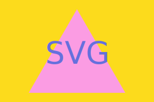

# The Quick SVG Logo Generator

## Table of Contents

- [Description](#description)
- [Installation](#installation)
- [Usage](#usage)
- [Tests](#tests)
- [Questions](#questions)
- [License](#license)

## Description

This is a small and very simple SVG logo generator. It quickly generates a small svg file with a short amount of text, a square, triangle, or circle, and a background. All of these elements have their color chosen by the user. Enjoy a 90s-style logo generated by the app below: 

## Installation

Installation is simple. Download the files in the repository, execute "npm install", and run index.js with node ("node index.js")

## Usage

You can use this generator to quickly kick out some simple logos. It can be a good starting point for a simple svg file.

## Tests

Testing was rather simple, and tests can be found in the "test" folder of the repository. Testing consisted of ensuring that the outputs of the methods in the renderers.js file were correct. To run the test, simply run npm test from the command line

## Questions

You can contact me with questions in the following places: 

Github Profile: https://github.com/TrueWillB 

## License

This repo and all of its contents operate under MIT License. For details, please view the LICENSE file in the repository or click the badge: 
